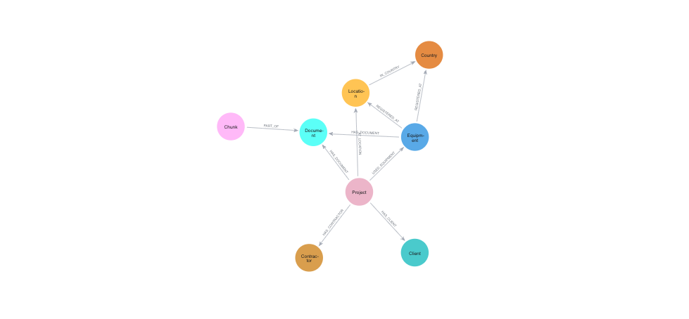
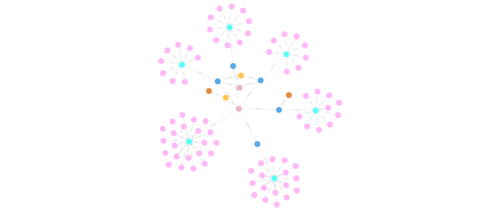
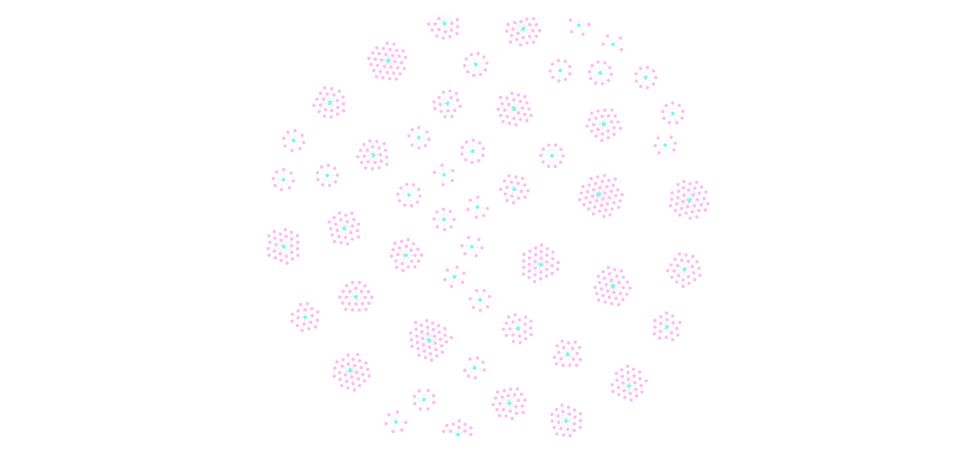

# Boskalis GraphRAG Demo

This repository demonstrates how **GraphRAG** can be applied to real-world Boskalis documents using **Neo4j**, **Model Context Protocol (MCP)**, **FastAPI**, and **Streamlit**.

The goal of this project is to show how unstructured documents (PDFs about **Projects** and **Equipment**) can be transformed into a **Knowledge Graph**, and how that graph can be queried and explored through a conversational interface powered by AI agents.

---

## Project Overview

The pipeline works as follows:

1. **Unstructured data ingestion**
   - PDF documents from the [Boskalis Download Center](https://boskalis.com/download-center)
   - Documents describe projects and equipment

2. **Graph construction**
   - Text is chunked and embedded
   - Entities such as `Project`, `Equipment`, `Document`, and `Chunk` are extracted
   - Everything is connected in a Neo4j knowledge graph

3. **GraphRAG with MCP**
   - A **Neo4j MCP Server** exposes the graph as structured context
   - LLMs can reason over graph relationships instead of raw text
   - Learn more: [Neo4j MCP Documentation](https://neo4j.com/developer/genai-ecosystem/model-context-protocol-mcp/)

4. **Backend API**
   - Built with **FastAPI**
   - Handles chatbot requests and MCP interactions

5. **Frontend**
   - **Streamlit** app for asking questions and exploring results

---

## Architecture

```
PDF Documents (Boskalis Download Center)
          ↓
Text Chunking & Entity Extraction
          ↓
Neo4j Knowledge Graph
          ↓
Neo4j MCP Server
          ↓
FastAPI Backend
          ↓
Streamlit Frontend
```

---

## Graph Data Model

The graph connects projects, equipment, documents, and text chunks in a structured way.

**Data model overview:**



---

## Example Graph Queries

Below are example Cypher queries you can run in **Neo4j Browser** to explore the graph.

### 1. Show a specific project with its relationships

```cypher
MATCH p1=(:Project {name: "Borssele Alpha/Beta Export Cables"})-[*2]-()
MATCH p2=(:Project {name: "Borssele Alpha/Beta Export Cables"})-[*3]-(:Chunk)
RETURN p1, p2
```


### 2. Show equipment relationships

```cypher
MATCH p1=(:Equipment {name: "Willem van Oranje"})-[*2]-()
RETURN p1
```


### 3. Show all documents

```cypher
MATCH p=(d:Document)-[]->()
RETURN p
```


### 4. Show all structured information

```cypher
MATCH p=(:Project)-[*]->(:!Document)
RETURN p
```


---

## Repository Structure

```
boskalis-graphrag/
├── chatbot/                    # AI agent and tools
│   ├── agent.py               # Main agent logic
│   ├── agent_tools/           # MCP tools for Neo4j interaction
│   ├── backend/               # FastAPI backend
│   │   ├── main.py           # API endpoints
│   │   └── renderables.py   # Response formatting
│   └── frontend/
│       └── streamlit/         # Streamlit UI
│           └── chat.py
├── create-graph/              # Graph creation notebooks
│   ├── 1 - Create Graph.ipynb
│   ├── 2 - Create Indexes.ipynb
│   └── documents/             # Source PDFs
│       ├── equipment/
│       └── projects/
└── images/                    # Documentation images
```

---

## Getting Started

### Prerequisites

- Python 3.11+
- Neo4j Database (local or cloud)
- UV package manager (or pip)

### Installation

1. Clone the repository:
```bash
git clone https://github.com/erikbijl/boskalis-graphrag.git
cd boskalis-graphrag
```

2. Install dependencies:
```bash
cd chatbot
uv pip install -r requirements.txt
# or
pip install -r requirements.txt
```

3. Set up environment variables (see `example_env.txt`)

4. Create the graph using the notebooks in `create-graph/`

### Running the Application

**Backend (FastAPI):**
```bash
cd chatbot
uv run uvicorn backend.main:app --reload
```
- Available at: http://127.0.0.1:8000/docs#/

**Frontend (Streamlit):**
```bash
cd chatbot
streamlit run frontend/streamlit/chat.py
```
- Available at: http://localhost:8501/

---

## Technologies Used

- **Neo4j** - Graph database for storing knowledge
- **Model Context Protocol (MCP)** - For AI agent/graph integration
- **FastAPI** - Backend API framework
- **Streamlit** - Frontend web application
- **LangChain/LangGraph** - Agent orchestration
- **Python 3.11+** - Primary programming language

---

## 📖 Learn More

- [Neo4j MCP Documentation](https://neo4j.com/developer/genai-ecosystem/model-context-protocol-mcp/)
- [Boskalis Download Center](https://boskalis.com/download-center)
- [GraphRAG Overview](https://neo4j.com/developer/graphrag/)

---

## License

This project is for demonstration purposes.

---
